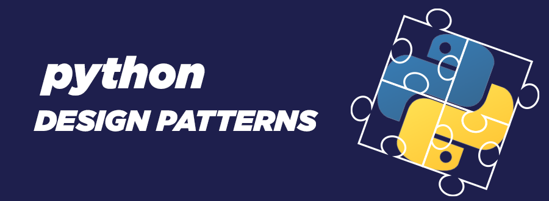

In software engineering, design patterns are typical solutions to commonly occurring problems in software design<br>



Support Group - <a href="https://t.me/+Ng1axYLNyBAyYTRi">Telegram</a> <br/>


### Creational Patterns
- [Singleton](#singleton_in_python)
- [Builder](#builder_in_python)
- [Factory](#factory_in_python)
- [Prototype](#proto_type_in_python)

### Structural Patterns
- [Adapter](#adapter_in_python)
- [Bridge (still learning..)](#bridge_in_python)
- [Composite](#compsite_in_python)
- [Decorator](#decorator_in_python)
- [Facade](#facade_in_python)
- [Proxy](#proxy_in_python)

### Behavioral Patterns
- [Chain of Responsibility](#chain_of_responsiblity_in_python)
- [Command](#command_in_python)
- [Mediator](#mediator_in_python)
- [Observer](#observer_in_python)
- [Strategy](#strategy_in_python)
- [Template Method](#template_in_python)


# Patterns

## singleton_in_python
```python
"""
The Singleton pattern is a design pattern that ensures a class has only
one instance and provides a global point of access to that instance.
It's often used in scenarios where exactly one object is needed to coordinate
actions across the system.
"""
import unittest

import colorama


class PaymeApi:
    """
    the payme provider api.
    """
    _instance = None

    def __init__(self, payme_id: str = None, payme_key: str = None) -> None:
        # pylint: disable=E0203
        if not self._initialized:
            self.payme_id = payme_id
            self.payme_key = payme_key
            self._initialized = True

    def __new__(cls, payme_id=None, payme_key=None) -> None:
        if cls._instance is None:
            cls._instance = super(PaymeApi, cls).__new__(cls)
            cls._instance._initialized = False
        return cls._instance

    def add_card(self) -> None:
        """
        cards.create method of payme JSONRPC
        """
        raise NotImplementedError(
            "not implemented yet."
        )


class PaymeApiTestCase(unittest.TestCase):
    """
    payme api test cases for checking singleton point.
    """
    def setUp(self) -> None:
        self.payme_api_first = PaymeApi(
            payme_id="782dc54f-a10c-44b8-a879-e92b12df55b5",
            payme_key="74f289a9-761c-4112-97db-c13d03e2f194"
        )
        self.payme_api_second = PaymeApi()

    def test_payme_api_singleton(self) -> None:
        """
        test objects point in memory
        """
        id_1 = hex(id(self.payme_api_first))
        id_2 = hex(id(self.payme_api_second))

        print(colorama.Fore.GREEN + f"address of payme_api_first {self.payme_api_first}")
        print(colorama.Fore.GREEN + f"address of payme_api_first {self.payme_api_second}")

        self.assertEqual(first=id_1, second=id_2)


if __name__ == "__main__":
    unittest.main()

```

## builder_in_python
```python
"""
The Builder design pattern is a creational pattern that
provides a flexible solution to construct complex objects.
It's particularly useful when an object needs to be created with
many optional and required configurations.
The Builder pattern separates the construction of a complex object from
its representation, making it possible to use the same construction process
to create different representations.

Use cases:
    1) Used for constructing complex objects with multiple optional
        and mandatory fields or properties, like constructing GUI elements,
            complex documents, or various types of composite objects.

    2) Enhances readability and maintainability, especially when creating
        an object with numerous properties, some of which may be optional.
"""
import unittest


class PaymentProvider:
    """
    The abstract payment provider class.
    """
    def __init__(self) -> None:
        self.provider_name = None
        self.is_global = None

    def get_provider_name(self) -> str:
        """
        Get provider name method.
        """
        return self.provider_name

    def get_is_global(self) -> bool:
        """
        Get is_global method.
        """
        return self.is_global


class PaymentProviderBuilder:
    """
    The payment provider builder class.
    """
    def __init__(self) -> None:
        self.provider = PaymentProvider()

    def set_payment_provider(self, provider_name: str) -> 'PaymentProviderBuilder':
        """
        The payment provider setter that sets the provider name for abstract payment provider.
        """
        self.provider.provider_name = provider_name
        return self

    def set_is_global(self, is_global: bool) -> 'PaymentProviderBuilder':
        """
        Is global payment provider setter.
        """
        self.provider.is_global = is_global
        return self

    def build(self) -> PaymentProvider:
        """
        The payment provider builder method.
        """
        return self.provider


class PaymentDirector:
    """
    The payment director.
    """
    def construct_payme_provider(self, builder: PaymentProviderBuilder) -> PaymentProvider:
        """
        The payment director constructor that returns a new instance of the payment provider.
        usage:
            director = PaymentDirector()
            builder = PaymentProviderBuilder()
            payme = director.construct_payme_provider(builder)
        """
        builder.set_payment_provider(provider_name="payme").set_is_global(is_global=False)
        return builder.build()

    def construct_payze_provider(self, builder: PaymentProviderBuilder) -> PaymentProvider:
        """
        The payment director constructor that returns a new instance of the payment provider.

        usage:
            director = PaymentDirector()
            builder = PaymentProviderBuilder()
            payze = director.construct_payze_provider(builder)
        """
        builder.set_payment_provider(provider_name="payze").set_is_global(is_global=True)
        return builder.build()


class TestPaymentProvider(unittest.TestCase):
    """
    Unit tests for the PaymentProvider class.
    """
    def test_get_provider_name(self) -> None:
        """
        test the get provider name
        """
        provider = PaymentProvider()
        provider.provider_name = "TestProvider"
        self.assertEqual(provider.get_provider_name(), "TestProvider")

    def test_get_is_global(self) -> None:
        """
        test the get_is_global method.
        """
        provider = PaymentProvider()
        provider.is_global = True
        self.assertTrue(provider.get_is_global())


class TestPaymentProviderBuilder(unittest.TestCase):
    """
    Unit tests for the PaymentProviderBuilder class.
    """
    def test_build_payment_provider(self) -> None:
        """
        test the build payment provider.
        """
        builder = PaymentProviderBuilder()
        provider = builder.set_payment_provider("TestProvider").set_is_global(True).build()
        self.assertIsInstance(provider, PaymentProvider)
        self.assertEqual(provider.get_provider_name(), "TestProvider")
        self.assertTrue(provider.get_is_global())


class TestPaymentDirector(unittest.TestCase):
    """
    Unit tests for the PaymentDirector class.
    """
    def test_construct_payme_provider(self) -> None:
        """
        test construct payme provider.
        """
        director = PaymentDirector()
        builder = PaymentProviderBuilder()
        provider = director.construct_payme_provider(builder)
        self.assertEqual(provider.get_provider_name(), "payme")
        self.assertFalse(provider.get_is_global())

    def test_construct_payze_provider(self) -> None:
        """
        test construct payze provider.
        """
        director = PaymentDirector()
        builder = PaymentProviderBuilder()
        provider = director.construct_payze_provider(builder)
        self.assertEqual(provider.get_provider_name(), "payze")
        self.assertTrue(provider.get_is_global())


if __name__ == '__main__':
    unittest.main()

```

## factory_in_python

```python
"""
The Factory Method is a creational design pattern
that provides an interface for creating objects but
allows subclasses to alter the type of objects that will be created.
It is useful when you have a class that cannot anticipate
the class of objects it needs to create, or when a class wants to delegate
the responsibility of object creation to its subclasses.
"""
import abc

import unittest
from unittest.mock import patch

from io import StringIO


class IPayment(abc.ABC):
    """
    the payment abstract class.
    """
    @abc.abstractmethod
    def pay(self, amount: float) -> bool:
        """
        the pay abstract method.
        """
        raise NotImplementedError(
            "not implemented error."
        )


class Payme(IPayment):
    """
    the implementation of payment abstract class.
    """
    def pay(self, amount: float) -> bool:
        """
        the pay abstract method implementation.
        """
        print(f"payment processed with payme amount: {amount}")
        return True


class Payze(IPayment):
    """
    the implementation of payment abstract class.
    """
    def pay(self, amount: float) -> bool:
        """
        the pay abstract method implementation.
        """
        print(f"payment processed with payze amount: {amount}")
        return True


class UniPost(IPayment):
    """
    the implementation of payment abstract class.
    """
    def pay(self, amount: float) -> bool:
        """
        the pay abstract method implementation.
        """
        print(f"payment processed with uni-post amount: {amount}")
        return True


class Factory:
    """
    the factory implementation.
    """

    def get_payment(self, provider: str) -> IPayment:
        """
        the payment abstract method implementation.
        includes provider types ("payme", "payze", "unipost")
        """
        payment: IPayment = None

        if provider == "payme":
            payment = Payme()

        if provider == "payze":
            payment = Payze()

        if provider == "unipost":
            payment = UniPost()

        return payment


class TestPayment(unittest.TestCase):
    """
    the payment test.
    """
    def setUp(self):
        self.factory = Factory()

    @patch('sys.stdout', new_callable=StringIO)
    def assert_payment_output(self, provider, amount, expected_output, mock_stdout) -> None:
        """
        the payment test output.
        """
        payment = self.factory.get_payment(provider)
        payment.pay(amount)
        self.assertEqual(mock_stdout.getvalue().strip(), expected_output)

    def test_payme_payment(self) -> None:
        """
        the payme payment test output.
        """
        self.assert_payment_output("payme", 15000, "payment processed with payme amount: 15000")

    def test_payze_payment(self) -> None:
        """
        the payze payment test output.
        """
        self.assert_payment_output("payze", 17000, "payment processed with payze amount: 17000")

    def test_unipost_payment(self) -> None:
        """
        the test unipost payment.
        """
        self.assert_payment_output("unipost", 18000, "payment processed with uni-post amount: 18000")


if __name__ == '__main__':
    unittest.main()

```

## proto_type_in_python

```python
"""
The Prototype design pattern is part of the creational patterns,
which deal with object creation mechanisms. It is particularly useful
in situations where the construction of objects is costly or complex.
The Prototype pattern lets you copy existing objects without making your
code dependent on their classes, thus reducing the complexity of creating new instances.

use cases:
    1) Useful in scenarios where you want to avoid repeating
        the initialization process that is costly or complex.

    2) Suitable for systems needing to be independent of how its objects are created,
        composed, and represented.

    interface: prototype
    methods: clone, and deep_clone.
"""
import copy
import typing

import unittest


class Car:
    """
    the car class.
    """
    def __init__(self, name: str) -> None:
        self.name = name


class Prototype:
    """
    the prototype class.
    """
    def clone(self):
        """
        Create a shallow copy of the object.
        """
        return copy.copy(self)

    def deep_clone(self):
        """
        Create a deep copy of the object.
        """
        return copy.deepcopy(self)


class ConcretePrototype(Prototype):
    """
    con create prototype class.
    usages:
        prototype = ConcretePrototype(obj=Car)
        cloned_prototype = prototype.clone()
        deep_cloned_prototype = prototype.deep_clone()
    """
    def __init__(self, obj: typing.Any) -> None:
        self.obj = obj


class TestPrototypePattern(unittest.TestCase):
    """
    Unit tests for the Prototype pattern implementation.
    """

    def test_shallow_clone(self) -> None:
        """
        the test shallow clone.
        """
        car = Car("Original Car")
        prototype = ConcretePrototype(obj=car)
        cloned_prototype = prototype.clone()

        self.assertIsNot(prototype, cloned_prototype)
        self.assertEqual(prototype.obj.name, cloned_prototype.obj.name)

    def test_deep_clone(self) -> None:
        """
        the test deep clone
        """
        car = Car("Original Car")
        prototype = ConcretePrototype(obj=car)
        deep_cloned_prototype = prototype.deep_clone()

        self.assertIsNot(prototype, deep_cloned_prototype)
        self.assertIsNot(prototype.obj, deep_cloned_prototype.obj)
        self.assertEqual(prototype.obj.name, deep_cloned_prototype.obj.name)


if __name__ == '__main__':
    unittest.main()

```

## sets_in_python

```python
"""
sets in python are a fundamental data structure that
represents an unordered collection of unique elements,
here's more information about sets in python:

features:
    uniqueness:
        sets automatically remove duplicate elements,
        storing only unique items.

    unordered:
        the elements in a set are not stored in any particular order,
        meaning they don't support indexing or slicing.

    mutability:
        standard sets are mutable, meaning elements can be added or removed,
        python also offers an immutable version called frozenset.

    set comprehensions:
        python supports set comprehensions,
        a concise way to create sets based on existing iterables

how works with big O:
    creation (set(iterable)):
        time complexity: O(n) - proportional to the number of elements in the iterable.

    insertion (set.add(elem)):
        time complexity: O(1) - generally constant time,
        although can be worse if a rehash is required.

    deletion set.remove(elem), set.discard(elem):
        time Complexity: O(1) - typically constant time,
        but can vary depending on the structure of the
        set and the element being removed.

    membership test (elem in set):
        time complexity: O(1) - usually constant time due to hashing,
        but can degrade in certain cases.

    length calculation (len(set)):
        time Complexity: O(1) - constant time operation.

    set operations involving two sets:
        union (set1 | set2 or set1.union(set2))
        time complexity: O(n + m) - where n and m are the sizes of the sets.

    intersection (set1 & set2 or set1.intersection(set2)):
        time complexity: O(min(n, m)) - where n and m are the sizes of the sets
        iterates over the smaller set and checks for membership in the larger set.

    difference (set1 - set2 or set1.difference(set2)):
        time complexity: O(n) - where n is the size of the set1;
        iterates over set1 and checks for non-membership in set2.

    symmetric Difference (set1 ^ set2 or set1.symmetric_difference(set2))
        time Complexity: O(n + m) - involves iterating over both sets.
"""
import unittest


class TestSetOperations(unittest.TestCase):
    """
    the testcases for set operations
    """
    def setUp(self):
        # This method is called before each test
        self.set1 = {1, 2, 3}
        self.set2 = {3, 4, 5}

    def test_union(self) -> None:
        """
        the test union.
        """
        result = self.set1 | self.set2
        self.assertEqual(result, {1, 2, 3, 4, 5})

    def test_intersection(self) -> None:
        """
        the test intersection.
        """
        result = self.set1 & self.set2
        self.assertEqual(result, {3})

    def test_difference(self) -> None:
        """
        the test differance
        """
        result = self.set1 - self.set2
        self.assertEqual(result, {1, 2})

    def test_symmetric_difference(self) -> None:
        """
        the test symmetric differance
        """
        result = self.set1 ^ self.set2
        self.assertEqual(result, {1, 2, 4, 5})

    def test_subset(self) -> None:
        """
        the test subset.
        """
        self.assertTrue({1, 2}.issubset(self.set1))

    def test_superset(self) -> None:
        """
        the test superset.
        """
        self.assertTrue(self.set1.issuperset({1, 2}))

    def test_membership(self) -> None:
        """
        the test membership.
        """
        self.assertIn(1, self.set1)
        self.assertNotIn(4, self.set1)

    def test_add_and_remove(self) -> None:
        """
        the test add and remove.
        """
        self.set1.add(4)
        self.assertIn(4, self.set1)
        self.set1.remove(4)
        self.assertNotIn(4, self.set1)

    def test_discard(self) -> None:
        """
        the test discard.
        """
        self.set1.discard(3)
        self.assertNotIn(3, self.set1)

    def test_len(self) -> None:
        """
        the test len.
        """
        self.assertEqual(len(self.set1), 3)

    def test_copy(self) -> None:
        """
        the test copy.
        """
        set_copy = self.set1.copy()
        self.assertEqual(set_copy, self.set1)

    def test_clear(self) -> None:
        """
        the test clear
        """
        self.set1.clear()
        self.assertEqual(len(self.set1), 0)


if __name__ == '__main__':
    unittest.main()
```

## adapter_in_python
```python
"""
The Adapter pattern provides a different interface for a class. We can
think about it as a cable adapter that allows you to charge a phone
somewhere that has outlets in a different shape. Following this idea,
the Adapter pattern is useful to integrate classes that couldn't be
integrated due to their incompatible interfaces.
"""
import abc
import typing
import unittest
from io import StringIO
from unittest.mock import patch


class Payment(abc.ABC):
    """
    the adapter class.
    """
    @abc.abstractmethod
    def pay(self, amount) -> bool:
        """
        the pay abstract method
        """

        raise NotImplementedError(
            "not implemented yet!"
        )


class Credit:
    """
    the credit payment.
    """
    def pay_credit(self, amount) -> bool:
        """
        payment for a credit.
        """
        print(f"payment for credit: {amount}")
        return True


class Debt:
    """
    the debt payment.
    """
    def pay_debt(self, amount) -> bool:
        """
        payment for debt.
        """
        print(f"payment for debt: {amount}")
        return True


class Trip:
    """
    the trip payment.
    """
    def pay_trip(self, amount) -> bool:
        """
        the pay trip.
        """
        print(f"payment for trip: {amount}")
        return True


class PayAdapter(Payment):
    """
    the payment adapter.
    usage:
        credit = Credit()
        payment = PayAdapter(credit)
        payment.pay(amount=2000)

        debt = Debt()
        payment = PayAdapter(reason=debt)
        payment.pay(amount=1000)

        debt = Trip()
        payment = PayAdapter(reason=debt)
        payment.pay(amount=4000)
    """
    def __init__(self, reason: typing.Union[Credit, Debt, Trip]) -> None:
        self.reason = reason

    def pay(self, amount) -> bool | Exception:
        if isinstance(self.reason, Credit):
            return self.reason.pay_credit(amount)
        if isinstance(self.reason, Debt):
            return self.reason.pay_debt(amount)
        if isinstance(self.reason, Trip):
            return self.reason.pay_trip(amount)

        raise Exception(f"unknown reason: {self.reason}")


class TestPayment(unittest.TestCase):
    """
    the test payment.
    """
    def test_payment_abstract_method(self) -> None:
        """
        You cannot create an instance of an abstract class
        """
        # pylint: disable=E0110
        with self.assertRaises(TypeError):
            payment = Payment()
            payment.pay(1000)


class TestCredit(unittest.TestCase):
    """
    test credit payment.
    """
    def test_pay_credit(self) -> None:
        """
        test pay credit.
        """
        credit = Credit()
        with patch('sys.stdout', new_callable=StringIO) as mock_stdout:
            result = credit.pay_credit(2000)
            self.assertTrue(result)
            self.assertEqual(mock_stdout.getvalue().strip(), "payment for credit: 2000")


class TestDebt(unittest.TestCase):
    """
    test debt payment.
    """
    def test_pay_debt(self) -> None:
        """
        test payment debt.
        """
        debt = Debt()
        with patch('sys.stdout', new_callable=StringIO) as mock_stdout:
            result = debt.pay_debt(1000)
            self.assertTrue(result)
            self.assertEqual(mock_stdout.getvalue().strip(), "payment for debt: 1000")


class TestTrip(unittest.TestCase):
    """
    test debt payment.
    """
    def test_pay_trip(self) -> None:
        """
        test pay trip method.
        """
        trip = Trip()
        with patch('sys.stdout', new_callable=StringIO) as mock_stdout:
            result = trip.pay_trip(4000)
            self.assertTrue(result)
            self.assertEqual(mock_stdout.getvalue().strip(), "payment for trip: 4000")


class TestPayAdapter(unittest.TestCase):
    """
    test adapter payment.
    """
    def test_pay_adapter_credit(self) -> None:
        """
        test pay adapter credit method.
        """
        credit = Credit()
        payment_adapter = PayAdapter(credit)
        with patch('sys.stdout', new_callable=StringIO) as mock_stdout:
            result = payment_adapter.pay(2000)
            self.assertTrue(result)
            self.assertEqual(mock_stdout.getvalue().strip(), "payment for credit: 2000")

    def test_pay_adapter_debt(self) -> None:
        """
        test pay adapter debt.
        """
        debt = Debt()
        payment_adapter = PayAdapter(debt)
        with patch('sys.stdout', new_callable=StringIO) as mock_stdout:
            result = payment_adapter.pay(1000)
            self.assertTrue(result)
            self.assertEqual(mock_stdout.getvalue().strip(), "payment for debt: 1000")

    def test_pay_adapter_trip(self) -> None:
        """
        test pay adapter trip.
        """
        trip = Trip()
        payment_adapter = PayAdapter(trip)
        with patch('sys.stdout', new_callable=StringIO) as mock_stdout:
            result = payment_adapter.pay(4000)
            self.assertTrue(result)
            self.assertEqual(mock_stdout.getvalue().strip(), "payment for trip: 4000")

    def test_pay_adapter_unknown_reason(self) -> None:
        """
        test pay unknown reason
        """
        unknown_reason = "Unknown"
        payment_adapter = PayAdapter(unknown_reason)
        with self.assertRaises(Exception) as context:
            payment_adapter.pay(1000)
        self.assertEqual(str(context.exception), f"unknown reason: {unknown_reason}")


if __name__ == '__main__':
    unittest.main()

```

## bridge_in_python
```python
"""
The Bridge design pattern in Python is a structural pattern that
separates an object's abstraction (i.e., its high-level logic)
from its implementation (i.e., its low-level details) so that they can vary independently.
This separation allows you to change and extend the implementations without affecting
the abstraction or high-level code.
"""
import abc


class Implementor(abc.ABC):
    """
    abcstrac implementor class.
    """
    @abc.abstractmethod
    def operation(self) -> None:
        """
        abstract operation.
        """
        raise NotImplementedError(
            "not implemented yet!"
        )


class ConcreteImplementorA(Implementor):
    """
    way to to implement.
    """
    def operation(self) -> str:
        print("implemented with way a")
        return "implemented with way a"


class ConcreteImplementorB(Implementor):
    """
    way to to implement.
    """
    def operation(self) -> str:
        print("implemented with way b")
        return "implemented with way b"


class Abstraction:
    """
    abstraction class.

    usages:
        impl_a = ConcreteImplementorA()
        abstraction1 = ConcreteAbstraction1(impl_a)
        print(abstraction1.operation())
    """
    def __init__(self, implementor):
        self.implementor = implementor

    def operation(self) -> str:
        """
        the operation
        """
        return f"Abstraction operation using {self.implementor.operation()}"


class ConcreteAbstraction1(Abstraction):
    """
    concrete abstraction class.
    """


class ConcreteAbstraction2(Abstraction):
    """
    concrete abstraction class.
    """
```


## compsite_in_python
```python
"""
The Composite design pattern is a structural design pattern that allows
you to compose objects into tree structures to represent part-whole hierarchies.
It lets you treat individual objects and compositions of objects uniformly,
making it easier to work with complex hierarchies.

usage:
    Graphics Systems:
        Representing shapes, where a shape can be a simple geometric
        figure (like a line or circle) or a complex composite shape
        made up of several simple shapes.

    File Systems:
        Representing files and directories as a tree structure.

    UI Components:
        Building complex user interfaces with nested components,
        such as windows containing panels containing buttons.
"""
import abc


class PaymentComponent(abc.ABC):
    """
    component abstract base class.
    """
    @abc.abstractmethod
    def p2p(self, amount) -> None:
        """
        the operation, should be implement
        """


class PaymeLeaf(PaymentComponent):
    """
    hese are the individual objects that do not have children in the hierarchy.
    they implement the operations defined by the Component interface.
    """
    FEE = 0.02

    def p2p(self, amount) -> float:
        """
        payme fee 0.2%
        """
        fee = amount * self.FEE
        finally_amount = amount + fee

        return f"finally amount with payme: {finally_amount}"


class PayzeLeaf(PaymentComponent):
    """
    hese are the individual objects that do not have children in the hierarchy.
    they implement the operations defined by the Component interface.
    """
    FEE = 0.01

    def p2p(self, amount) -> float:
        """
        payze fee 0.1%
        """
        fee = amount * self.FEE
        finally_amount = amount + fee

        return f"finally amunt with payze: {finally_amount}"


class UniPostLeaf(PaymentComponent):
    """
    hese are the individual objects that do not have children in the hierarchy.
    they implement the operations defined by the Component interface.
    """
    FEE = 0.0

    def p2p(self, amount) -> float:
        """
        uni-post fee 0.0%
        """
        fee = amount * self.FEE
        finally_amount = amount + fee

        return f"finally amunt with uni-post: {finally_amount}"


class PaymentComposite(PaymentComponent):
    """
    composite components.
    """
    def __init__(self):
        self.children = []
        self.result = []

    def add(self, component) -> None:
        """
        adding components.
        """
        self.children.append(component)

    def p2p(self, amount=None) -> float:
        for child in self.children:
            self.result.append(child.p2p(amount))

        print(f"the results of child classes: {self.result}")


if __name__ == "__main__":
    payme_leaf = PaymeLeaf()
    payze_leaf = PayzeLeaf()
    unipost_leaf = UniPostLeaf()

    composite = PaymentComposite()

    composite.add(payme_leaf)
    composite.add(payze_leaf)
    composite.add(unipost_leaf)

    # show results.
    composite.p2p(
        amount=100_000
    )
```

## decorator_in_python
```python
"""
The Decorator pattern is a structural design pattern that allows
you to add new behaviors or responsibilities to objects without
altering their existing code. It is achieved by creating a set
of decorator classes that are used to wrap concrete components.
"""
import abc


class NotificationService(abc.ABC):
    """
    the abstract.
    """
    @abc.abstractmethod
    def send(self, message):
        """
        abstract method to send.
        """


class EmailNotificationService(NotificationService):
    """
    email notification service.
    """
    def send(self, message):
        print(f"Sending email: {message}")


class NotificationDecorator(NotificationService):
    """
    notification decorator.
    """
    def __init__(self, notification_service):
        self._notification_service = notification_service

    @abc.abstractmethod
    def send(self, message):
        pass


class EncryptionDecorator(NotificationDecorator):
    """
    encryption decorator.
    """
    def send(self, message):
        encrypted_message = f"Encrypting message: {message}"
        self._notification_service.send(encrypted_message)


class LoggingDecorator(NotificationDecorator):
    """
    logging decorator.
    """
    def send(self, message):
        print(f"Logging message: {message}")
        self._notification_service.send(message)


if __name__ == "__main__":
    email_service = EmailNotificationService()

    encrypted_email_service = EncryptionDecorator(email_service)
    logged_encrypted_email_service = LoggingDecorator(encrypted_email_service)

    logged_encrypted_email_service.send("Hello, Decorator Pattern!")
```

# facade_in_python
```python
"""
The Facade pattern is a structural design pattern that provides a simplified
interface to a complex system, making it easier for clients to interact with
that system. It acts as a higher-level interface that hides the underlying
complexity of a set of subsystems or classes. This pattern promotes loose
coupling between the client code and the subsystems it interacts with.
"""


# system 1
class Trip:
    """
    the trip system.
    """
    def start(self) -> None:
        """
        start the trip.
        """
        print("trip has been started")

    def stop(self) -> None:
        """
        stop the trip.
        """
        print("trip has been stopped")


# system 2
class Payment:
    """
    the payment system.
    """
    def has_debt(self) -> bool:
        """
        checks client's debt
        """
        return True


# Facade
class TripFacade:
    """
    the trip facade pattern.
    """
    def __init__(self):
        self.trip = Trip()
        self.payment = Payment()

    def start_trip(self) -> bool:
        """
        start the trip.
        """
        has_debt = self.payment.has_debt()

        if has_debt is True:
            print("client has debt!")
            self.trip.stop()
            return False

        self.trip.start()
        return True

    def finish_trip(self) -> None:
        """
        stop the trip.
        """
        print("trip finished successfully!")


# client code
if __name__ == "__main__":
    trip = TripFacade()
    STARTED = trip.start_trip()

    if STARTED:
        trip.finish_trip()
```

## proxy_in_python
```python
"""
The Proxy pattern is a structural design pattern that provides
a surrogate or placeholder for another object to control access to it.
It is often used to add an extra layer of control over the real object,
which can be useful for various purposes such as lazy loading, access control,
logging, monitoring, or providing a simplified interface to the client.
In Python, proxies are implemented using classes that mimic the interface
of the real object and delegate calls to the real object as needed.

advantage of proxy pattern:
    1) Lazy Loading: Proxies can be used for lazy loading of expensive resources or objects.
    The RealSubject is created only when it is actually needed, improving performance.

    2) Access Control: Proxies can enforce access control policies by adding authentication
    or authorization checks before allowing requests to reach the RealSubject.

    3) Logging and Monitoring: Proxies can log method invocations or collect statistics
    on the RealSubject's usage, helping with debugging and performance analysis.

    4) Simplified Interface: Proxies can provide a simplified or restricted interface
    to the RealSubject, hiding its complexity from clients.

use cases:
    1) Virtual Proxies: When dealing with large and expensive objects,
        a proxy can provide a lightweight placeholder until the actual object is needed.

    2) Access Control Proxies: Proxies can control access to sensitive resources
        by adding authentication and authorization checks.

    3) Logging Proxies: Proxies can log method calls for debugging or monitoring purposes.

    4) Remote Proxies: In distributed systems, proxies can represent objects located on
        remote servers and handle communication details like network requests.
"""
import abc


class Subject(abc.ABC):
    """
    Subject Interface
    """
    @abc.abstractmethod
    def request(self) -> None:
        """
        request abstractmethod
        """
        raise NotImplementedError(
            "not implement yet!"
        )


class RealSubject(Subject):
    """
    the real subject.
    """
    def request(self):
        print("RealSubject: Handling request")


class Proxy(Subject):
    """
    the proxy class.
    """
    def __init__(self):
        self._real_subject = None

    def request(self):
        if self._real_subject is None:
            self._real_subject = RealSubject()

        print("Proxy: Checking access")
        self._real_subject.request()


if __name__ == "__main__":
    proxy = Proxy()

    proxy.request()
```

#### chain_of_responsiblity_in_python
```python
"""
The Chain of Responsibility pattern is a behavioral
design pattern that allows you to pass requests along a
chain of handlers. Each handler decides whether to process
the request or pass it to the next handler in the chain.
This pattern promotes loose coupling between the sender and receiver
of a request and allows you to add or modify processing steps dynamically.

key concepts:
    1) handler: This is an abstract class or interface that defines
        the interface for handling requests. It typically contains a
            reference to the next handler in the chain.

    2) concrete: These are concrete implementations of the Handler interface.
        Each ConcreteHandler decides whether to handle the request or
            pass it to the next handler in the chain.

    3) client: The Client is responsible for initiating requests.
        It sends requests to the first handler in the chain.

advantages of the chain of responsibility pattern:
    1) decoupling: The pattern decouples senders and receivers of requests,
        allowing them to vary independently.

    2) dynamic Chain: You can add or remove handlers at runtime,
        creating dynamic chains of responsibility.

    3) single Responsibility: Each handler has a single responsibility,
        making the code easier to maintain and extend.

example:
     a full ATM (Bankomat) program with the Chain of Responsibility
        pattern involves multiple classes and a user interface,
            which is beyond the scope of a single response. However,
                I can provide you with a simplified example that demonstrates
                    the concept of using the Chain of Responsibility pattern to get cash from an ATM.
"""
import abc


class CashDispenser(abc.ABC):
    """
    Handler interface
    """
    def __init__(self):
        self.next_handler = None  # Initialize next_handler to None

    @abc.abstractmethod
    def dispense(self, amount):
        """
        disperses the given amount.
        """


class HundredDollarDispenser(CashDispenser):
    """
    ConcreteHandler for $100 bills
    """
    def dispense(self, amount):
        num_bills = amount // 100
        remainder = amount % 100
        if num_bills > 0:
            print(f"Dispensing {num_bills} $100 bills")
        if remainder > 0 and self.next_handler:
            self.next_handler.dispense(remainder)


class FiftyDollarDispenser(CashDispenser):
    """
    ConcreteHandler for $50 bills
    """
    def dispense(self, amount):
        num_bills = amount // 50
        remainder = amount % 50
        if num_bills > 0:
            print(f"Dispensing {num_bills} $50 bills")
        if remainder > 0 and self.next_handler:
            self.next_handler.dispense(remainder)


class TwentyDollarDispenser(CashDispenser):
    """
    ConcreteHandler for $20 bills.
    """
    def dispense(self, amount):
        num_bills = amount // 20
        remainder = amount % 20
        if num_bills > 0:
            print(f"Dispensing {num_bills} $20 bills")
        if remainder > 0 and self.next_handler:
            self.next_handler.dispense(remainder)


class TenDollarDispenser(CashDispenser):
    """
    ConcreteHandler for $10 bills
    """
    def dispense(self, amount):
        num_bills = amount // 10
        remainder = amount % 10

        if num_bills > 0:
            print(f"Dispensing {num_bills} $10 bills")
        if remainder > 0 and self.next_handler:
            self.next_handler.dispense(remainder)


# Client code to set up the chain
if __name__ == "__main__":
    dispenser100 = HundredDollarDispenser()
    dispenser50 = FiftyDollarDispenser()
    dispenser20 = TwentyDollarDispenser()
    dispenser10 = TenDollarDispenser()

    # Link the handlers in the desired order
    dispenser100.next_handler = dispenser50
    dispenser50.next_handler = dispenser20
    dispenser20.next_handler = dispenser10

    dispenser100.dispense(230)
```

## command_in_python
```python
"""
the Command design pattern is a behavioral design pattern
that encapsulates a request as an object, thereby allowing
for parameterization of clients with queues, requests, and operations.
It also provides support for undoable operations. The Command pattern
separates the sender (invoker) of a request from the object that performs
the request (receiver). It promotes loose coupling between the sender
and the receiver and allows for greater flexibility and extensibility in code.

key concepts:
    command: This is an interface or abstract class that
    declares an execute method, which is used to perform the desired action.
    Concrete command classes implement this interface and encapsulate specific actions.

    concrete command:
        These are concrete implementations of the Command interface.
        Each concrete command is responsible for invoking a specific operation on the receiver.

    receiver:
        The receiver is an object that knows how to perform the
            actual work or action associated with a command.

    invoker:
        The invoker is responsible for invoking commands.
        It holds a reference to a command object and triggers the command's execute method.

    client: The client creates and configures the command objects and sets up the invoker.

use cases:
    GUI Applications:
        Command patterns are used to implement actions like buttons,
            menu items, and keyboard shortcuts in graphical user interfaces.

    Transaction Management: Database transactions and logging systems
        often use the Command pattern to track and execute operations.

    Remote Control Systems: Remote control devices often use commands
        to control various electronic devices.

    Undo/Redo Functionality: Command patterns allow for
        undo and redo functionality in applications.
"""
import abc


class Command(abc.ABC):
    """
    Command interface.
    """
    @abc.abstractmethod
    def execute(self) -> None:
        """
        Command execute abstract method.
        """

    @abc.abstractmethod
    def undo(self) -> None:
        """
        Command undo abstract method.
        """


class Light:
    """
    Light receiver.
    """
    def turn_on(self):
        """
        Turn on command.
        """
        print("Light is on")

    def turn_off(self):
        """
        Turn off command.
        """
        print("Light is off")


class LightOnCommand(Command):
    """
    Concrete command to turn on the light.
    """
    def __init__(self, light: Light) -> None:
        self.light: Light = light

    def execute(self) -> None:
        self.light.turn_on()

    def undo(self) -> None:
        self.light.turn_off()


class RemoteControl:
    """
    The invoker class with undo/redo functionality.
    """
    def __init__(self):
        self.command = None
        self.command_history = []
        self.redo_stack = []

    def set_command(self, command):
        """
        Set command method.
        """
        self.command = command

    def press_button(self):
        """
        Execute the command and add it to the history.
        """
        if self.command:
            self.command.execute()
            self.command_history.append(self.command)
            self.redo_stack.clear()

    def press_undo(self):
        """
        Undo the last command.
        """
        if self.command_history:
            command = self.command_history.pop()
            command.undo()
            self.redo_stack.append(command)

    def press_redo(self):
        """
        Redo the last undone command.
        """
        if self.redo_stack:
            command = self.redo_stack.pop()
            command.execute()
            self.command_history.append(command)


# Client code
if __name__ == "__main__":
    light = Light()
    light_on = LightOnCommand(light)
    remote = RemoteControl()

    remote.set_command(light_on)
    remote.press_button()
    remote.press_undo()
    remote.press_redo()
```

## mediator_in_python
```python
"""
The Mediator design pattern is a behavioral design pattern that
is used to reduce the complexity and dependencies between tightly-coupled
objects communicating directly with each other. In Python, as in other
object-oriented languages, the Mediator pattern is implemented by encapsulating
the interactions between a set of objects within a mediator object.
This pattern promotes loose coupling by keeping objects from referring
to each other explicitly and allows their interaction to be handled by a central mediator.
"""
import abc


class Mediator(abc.ABC):
    """
    abstract mediator.
    """
    @abc.abstractmethod
    def notify(self, sender, event) -> None:
        """
        abstract mediator notify.
        """


class Payment:
    """
    the payment component.
    """
    def pay(self):
        """
        the implementation of pay method.
        """
        print("payment was successfull")


class Driver:
    """
    the driver component.
    """
    def finish_trip(self):
        """
        the implementation of finish method.
        """
        print("trip finished successfully")


class ConcreteMediator(abc.ABC):
    """
    concrete mediator class.
    """
    def __init__(self, component_payment, component_driver) -> None:
        self._component_payment: Payment = component_payment
        self._component_driver: Driver = component_driver

    def notify(self, event) -> None:
        """
        the implementation of notify method.
        """
        if event == "driver":
            print("mediator reacts on driver and triggers following operations")
            self._component_driver.finish_trip()

        if event == "payment":
            print("mediator reacts on payment and triggers following operations")
            self._component_payment.pay()


if __name__ == "__main__":
    component_driver = Driver()
    component_payment = Payment()

    mediator = ConcreteMediator(
        component_driver=component_driver,
        component_payment=component_payment
    )

    mediator.notify(
        event="driver"
    )
    mediator.notify(
        event="payment"
    )
```

## observer_in_python
```python
"""
The Observer pattern is a software design pattern that is
commonly used to create an efficient and flexible mechanism
for monitoring and reacting to changes in a system.
This pattern is especially useful in scenarios where an
object,known as the subject, needs to automatically notify a
list of other objects,known as observers, about any state changes.
"""
import abc


class Observer(abc.ABC):
    """
    the oberver abstraction.
    """
    def update(self, subject):
        """
        updater.
        """


class Subject:
    """
    the subject class.
    """
    def __init__(self):
        self._observers = []
        self._state = None

    def attach(self, observer):
        """
        attacher
        """
        if observer not in self._observers:
            self._observers.append(observer)

    def detach(self, observer):
        """
        detacher.
        """
        try:
            self._observers.remove(observer)
        except ValueError:
            pass

    def notify(self):
        """
        notifier.
        """
        for observer in self._observers:
            observer.update(self)

    @property
    def state(self):
        """
        state.
        """
        return self._state

    @state.setter
    def state(self, value):
        self._state = value
        self.notify()


class ConcreteObserverA(Observer):
    """
    implementation of Observer.
    """
    def update(self, subject):
        if subject.state < 3:
            print("ConcreteObserverA: Reacted to event")


class ConcreteObserverB(Observer):
    """
    implementation of Observer.
    """
    def update(self, subject):
        if subject.state >= 3:
            print("ConcreteObserverB: Reacted to event")


subject = Subject()


observer_a = ConcreteObserverA()
observer_b = ConcreteObserverB()

subject.attach(observer_a)
subject.attach(observer_b)

# Change the state of the subject
subject.state = 2
subject.state = 3
```

## strategy_in_python
```python
"""
The Strategy design pattern is a behavioral software design pattern that
enables selecting an algorithm's behavior at runtime. This pattern is particularly
useful in scenarios where you want to define a family of algorithms,
encapsulate each one, and make them interchangeable. The Strategy pattern
lets the algorithm vary independently from clients that use it.

components of the strategy pattern:
    1) Context: The class that uses a Strategy implementation to perform a task.
    2) Strategy Interface: A common interface for all concrete strategies.
        It declares a method the Context uses to execute a strategy.
    3) Concrete Strategies: Implementations of the Strategy interface,
        each representing a different algorithm.
"""
import abc


class Strategy:
    """
    abstract class.
    """
    @abc.abstractmethod
    def execute(self, data):
        """
        execute abstract method.
        """


class ConcreteStrategyA(Strategy):
    """
    Conrete strategy A
    """
    def execute(self, data):
        print(f"executing strategy A data: {data}")


class ConcreteStrategyB(Strategy):
    """
    Conrete strategy B
    """
    def execute(self, data):
        print(f"executing strategy B data: {data}")


class Context:
    """
    the context of strategy
    """
    def __init__(self, strategy):
        self._strategy = strategy

    def set_strategy(self, strategy: Strategy):
        """
        set strategy.
        """
        self._strategy = strategy

    def execute_strategy(self, data):
        """
        execute strategy.
        """
        return self._strategy.execute(data)


if __name__ == "__main__":
    data = {
        "name": "Muhammadali",
        "telegram": "@muhammadalive",
        "website": "https://muhammadalive.com"
    }

    context = Context(ConcreteStrategyA())
    result = context.execute_strategy(data)

    context.set_strategy(ConcreteStrategyB())
    result = context.execute_strategy(data)
```


## template_in_python
```python
"""
The Template Method design pattern is a behavioral pattern
that defines the skeleton of an algorithm in a method,
deferring some steps to subclasses. This pattern lets subclasses
redefine certain steps of an algorithm without changing the algorithm's structure.
It's particularly useful when there is a common workflow or series of steps,
but some steps may vary in their implementation across different contexts or subclasses.
"""
import abc


class PaymentProcessor(abc.ABC):
    """
    the payment processor template.
    """
    def process_payment(self, amount) -> None:
        """
        the template methods
        """
        self.authenticate()
        self.validate()
        self.create_check(amount)
        self.pay_check(amount)

    def authenticate(self):
        """
        Common step for authentication (can be overridden if necessary)
        """
        print("Authentication successful.")

    def validate(self):
        """
        Common step for validation (can be overridden if necessary)
        """
        print("Validation successful.")

    @abc.abstractmethod
    def create_check(self, amount):
        """
        create check method.
        """

    @abc.abstractmethod
    def pay_check(self, amount):
        """
        pay check method.
        """

    def hook(self):
        """
        override this method in your child classe
        """


class Payme(PaymentProcessor):
    """
    implementation of payment processor via payme
    """
    def create_check(self, amount):
        print(f"creating check with Payme amount: {amount}")

    def pay_check(self, amount):
        print(f"paying check with Payme amount: {amount}")


class Payze(PaymentProcessor):
    """
    implementation of payment processor via payme
    """
    def create_check(self, amount):
        print(f"creating check with Payze amount: {amount}")

    def pay_check(self, amount):
        print(f"paying check with Payze amount: {amount}")


class UniPost(PaymentProcessor):
    """
    implementation of payment processor via payme
    """
    def create_check(self, amount):
        print(f"creating check with UniPost amount: {amount}")

    def pay_check(self, amount):
        print(f"paying check with UniPost amount: {amount}")

    def validate(self):
        print("Validation successfull using UniPost")


def client_code(payment_processor: PaymentProcessor, amount: float):
    """
    client code for payment processor.
    """
    payment_processor.process_payment(amount)


if __name__ == "__main__":
    client_code(Payme(), 100)
    client_code(Payze(), 100)
    client_code(UniPost(), 100)
```